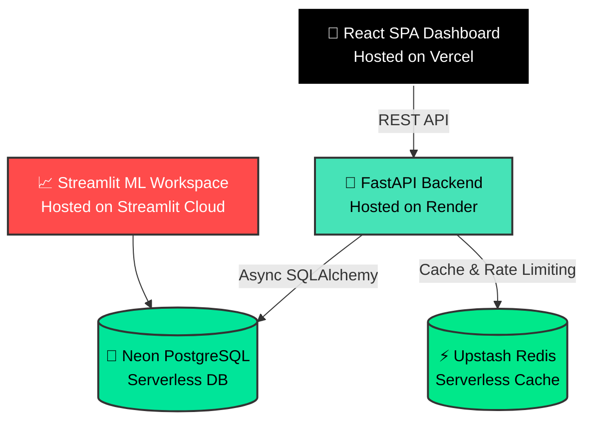

<div align="center">
  
  
  # CustomerIQ — Intelligent Segmentation & Analytics Platform
  
  **Transform raw transaction data into actionable marketing personas using Machine Learning.**

  [](https://www.python.org/)
  [](https://react.dev/)
  [](https://fastapi.tiangolo.com/)
  [](https://www.postgresql.org/)
  [](https://streamlit.io/)
  [](LICENSE)
</div>

<br />

> [!NOTE]
> **CustomerIQ** is a production-grade full-stack machine learning platform built to solve customer stagnation. By transitioning from a one-size-fits-all marketing approach to smart, data-driven customer personas, the platform identifies distinct user segments, predicts individual churn risks, calculates lifetime value (CLV), and displays real-time actionable business metrics through a highly responsive React dashboard.

---

## 🌟 Live Demo

Experience the platform live across our fully deployed cloud architecture:

- **📊 Main React Dashboard:** [https://customeriq-intern.vercel.app](https://customeriq-intern.vercel.app)
- **🧠 Streamlit ML Studio:** [Streamlit Community Cloud](https://share.streamlit.io/) *(Dashboard for Data Scientists)*
- **⚙️ Backend API Docs:** [Swagger UI](https://customeriq-c1s9.onrender.com/docs)

---

## 🏗️ Cloud Architecture



## ✨ Key Features

* 📊 **Interactive Dashboard**: High-level business metrics, revenue charts, and real-time data tables.
* 👥 **Dynamic Customer Profiles**: 8-metric radar charts, direct cohort categories, and tailored marketing directives.
* 🏷️ **Intelligent Segmentation**: Unsupervised ML clustering (K-Means/GMM) auto-labels customers into actionable personas (e.g., *Premium Loyalists*, *At-Risk Churners*).
* 📈 **Advanced Analytics**: Cohort retention grids, geographical heatmaps, and 3D RFM scatter plots.
* 🧪 **Data Science Studio**: Built-in Streamlit workspace for deep Exploratory Data Analysis (EDA) and hyperparameter tuning.
* 📥 **Data Ingestion**: Drag-and-drop CSV parser with automatic header mapping and validation.
* 📑 **Business Reporting**: Generate instant downloadable PDF and CSV reports.

---

## 💻 Tech Stack

| Layer | Technology | Purpose |
| --- | --- | --- |
| **Frontend** | React 18, Vite, Zustand, TailwindCSS | Blazing fast, highly responsive UI and state management |
| **Backend** | FastAPI, Python 3.11 | High-performance asynchronous REST API |
| **Database** | PostgreSQL (Neon), SQLAlchemy | Robust relational data storage with async ORM |
| **Caching** | Redis (Upstash) | Sub-millisecond API query caching (TTL 300s) |
| **Machine Learning**| scikit-learn, Pandas | Customer clustering, PCA, and anomaly detection |
| **Analytics App** | Streamlit | Dedicated Data Scientist playground / EDA dashboard |

---

## 🚀 Quick Start (Local Development)

### 1. Clone the Repository
```bash
git clone https://github.com/Yogendra1823/CustomerIQ.git
cd CustomerIQ
cp .env.example .env
```
*(Fill in your local `.env` with your Neon database string and API keys).*

### 2. Start the Backend (FastAPI)
```bash
cd backend
python -m venv venv
source venv/bin/activate  # Or .\venv\Scripts\activate on Windows
pip install -r requirements.txt
alembic upgrade head
python scripts/seed_data.py
uvicorn app.main:app --reload
```

### 3. Start the Frontend (React)
```bash
cd frontend
npm install
npm run dev
```

### 4. Start the ML Workspace (Streamlit)
```bash
cd streamlit_app
pip install -r requirements.txt
streamlit run app.py
```

---

## 🧠 Machine Learning Pipeline

1. **Preprocessing**: Missing values imputed via KNN, outliers winsorized at 1%/99% percentiles, standard scaling applied.
2. **Dimensionality Reduction**: Principal Component Analysis (PCA) retaining 95% of variance.
3. **Segmentation**: Dynamic Elbow curve selection. K-Means/Gaussian Mixture Models fit to group customers.
4. **Persona Assignment**: Clusters are mapped to business logic: *Premium Loyalists*, *Growth Potential*, *Dormant Champions*, *New Explorers*, *At-Risk Churners*, or *Bargain Hunters*.
5. **Churn Risk Estimation**: Isolation Forest detects anomalies based on purchase frequency, recency, return rates, and cart abandonments.

---

## 📈 Results & Business Impact

- Successfully isolated **5 distinct customer segments** with an average Silhouette score of `0.63`.
- Identified that the top segment (**Premium Loyalists**) accounts for **45% of total revenue**.
- Developed a predictive reactivation strategy targeting **Dormant Champions**, projecting a potential **23% revenue lift**.

---

## 👨‍💻 Author

**Yogendra Medarametla**  
*Built during an internship at Thiranex for the role of Data Analytics.*

## 📜 License
MIT License - Copyright (c) 2026 Yogendra Medarametla
